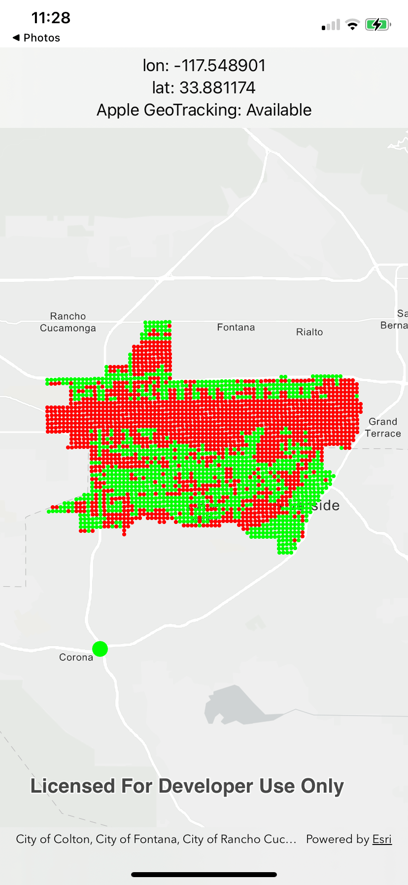

## Apple Geotracking Check Availability

A demo app that showcases how to check the geotracking availability of a location, and/or a larger area.

This app does…

- Check Apple Geotracking availability with [`ARGeoTrackingConfiguration.checkAvailability(at:completionHandler:)`](https://developer.apple.com/documentation/arkit/argeotrackingconfiguration/checkavailability(at:completionhandler:))
    - … by tapping on the map for a location
    - … by looping through a series of location points

### Background

With ARKit 4, Apple introduced Street View-based AR location services, which more accurately determine the current location by combining images captured by the camera, the device's GPS, and map topology information. Because Street View maps are "geo-referenced" — meaning all Street View images can be considered to have accurate geographical coordinates, visual algorithms can match the camera's location coordinates by comparing the camera footage with the Street View map.

Around 2021, when Apple Geotracking was first launched, the `ARGeoTrackingConfiguration` documentation listed the supported areas and cities. At that time, only core areas of a few major cities in the US and around the world supported geotracking (including, if I remember correctly, New York, San Francisco, Los Angeles, Chicago, Paris, and Singapore). Over time, the number of supported locations gradually increased. Some day in late 2023, while checking the documentation, I suddenly discovered that the list of supported cities disappeared!

Thus, I decided to create this quick demo to help with 2 things

- First, you can tap wherever on a map and decide whether that location supports Apple Geotracking
- Second, it shows that you can generate a "[fishnet](https://community.esri.com/t5/arcgis-pro-questions/create-points-with-uniform-distance/m-p/1143235#M51342)" of grid points, and use that to generate a rough estimate of what the geotracking coverage of an area look like
    - I have to admit that it might be better to have points with a more natural distribution across a region that represents various man-made features such as roads, buildings, parks, etc. to check the geotracking availability. Still, this demo is to show that you can find the points to use to check the coverage!

### SEO

Geotracking, coverage, Visual Positioning System (VPS), ARCore, Geo-spatial API, ARKit, AR, 街景定位, 视觉定位

### Related Blog

https://dev.to/yo1995/argeotrackingconfiguration-ping-guo-jie-jing-ding-wei-zhi-chi-di-qu-jjp

