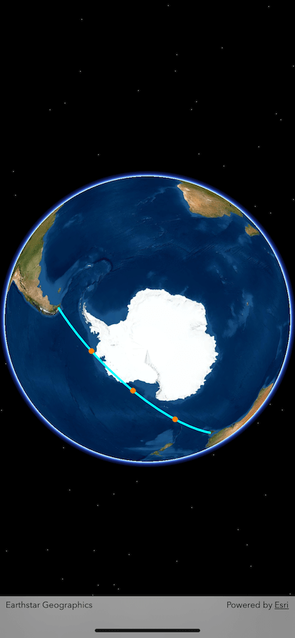

# Geodetic Division of A Line

To answer the question on https://v2ex.com/t/793974

## References

- Nick's answer on GeoNet: https://community.esri.com/t5/arcgis-runtime-sdk-for-net-questions/get-azimuth-value-from-point-a-to-point-b/td-p/644506
- iOS Runtime SDK ref - geodetic distance between 2 given points: https://developers.arcgis.com/ios/api-reference/interface_a_g_s_geometry_engine.html#a2dd1db31be63225c2ec60317c3df756e
