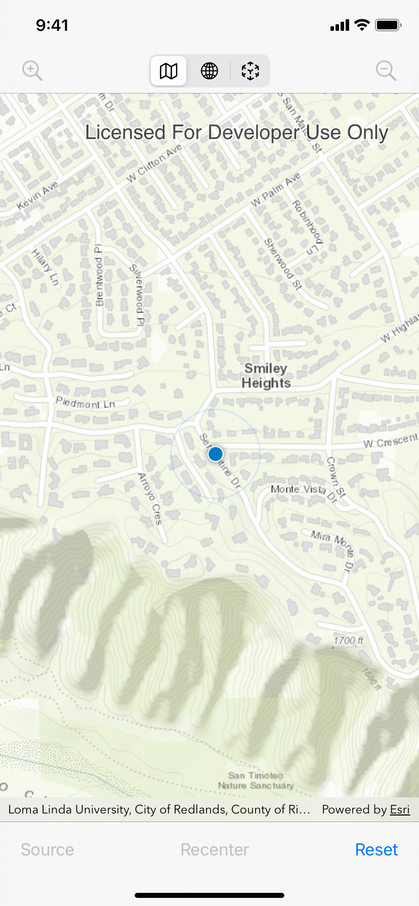
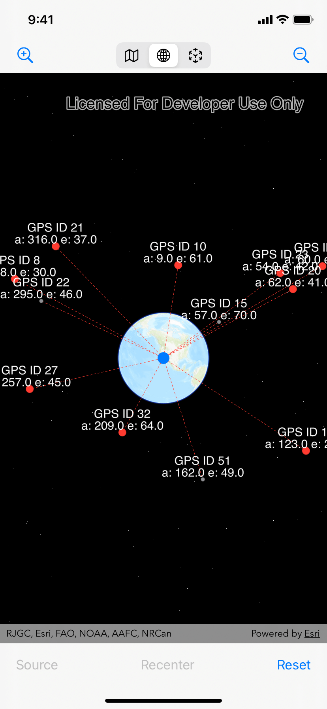

# NMEASatelliteDemo


Get the satellite coordinates in Geographic Coordinate System and render their positions in 3D. See the [blog post on Esri GeoNet Community](https://community.esri.com/t5/arcgis-runtime-sdks-blog/positions-of-gps-satellites-in-3d/ba-p/1070293).

This app demonstrates how to convert the azimuth-elevation coordinates notation of a satellite into latitude longitude coordinates.

It has 3 modes

- 🗺 **Map mode** leverages the ArcGIS Runtime SDK to receive NMEA sentences from a GPS receiver and show the location on a map
- 🌎 **Scene mode** plots the satellite positions in the space in a 3D scene
- 🔭 **AR mode** adds leader lines in the AR camera to show the directions of satellites

|🗺 Map|🌎 Scene|🔭 AR|
|-|-|-|
||||

|🛰 GPS on iPad|
|-|
||

## Description

This app converts azimuth-elevation coordinates of GPS satellites into lat-lon WGS84 coordinates.

## `$GPGSV` Sentence in NMEA Specs

A GNSS/GPS receiver periodically reports the satellites information with NMEA sentences. A `$GPGSV` sentence follows the GNSS Satellites In View specification. Per its spec doc:

> The GSV sentence provides the number of satellites (SV) in view, satellite ID numbers, elevation,
azimuth, and SNR value. The GSV sentence contains four satellites maximum per transmission. The
total number of sentences being transmitted and the sentence number being transmitted are indicated in
the first two fields.

## Keywords

ArcGIS Runtime SDK, ArcGIS Runtime, iOS, Swift, Satellite, NMEA, Azimuth, Elevation, 3D, GPS, GNSS, GPGSV

---

```txt
Last revision: 210621
```