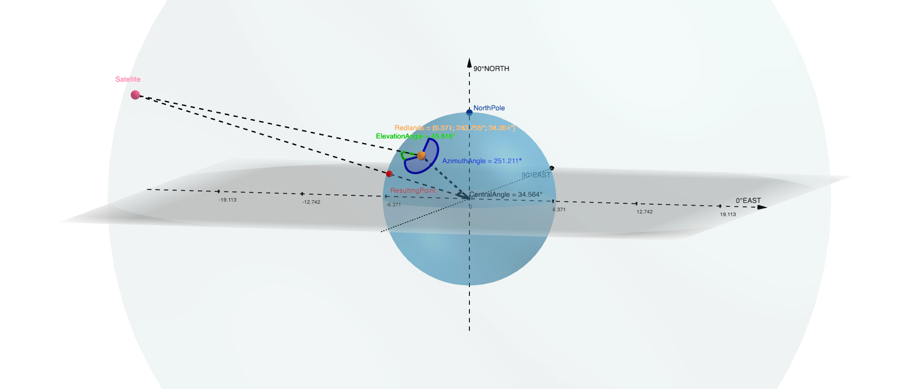

# NMEASatelliteDemoSwiftUI

Get the satellite coordinates in Geographic Coordinate System and render their positions in 3D.

This app demonstrates how to convert the azimuth-elevation coordinates notation of a satellite into latitude longitude coordinates.

It has 3 modes

- 🗺 **Map mode** leverages the ArcGIS Runtime SDK to receive NMEA sentences from a GPS receiver and show the location on a map
- 🌎 **Scene mode** plots the satellite positions in the space in a 3D scene
- 🔭 **AR mode** adds leader lines in the AR camera to show the directions of satellites

## Description

This app converts azimuth-elevation coordinates of GPS satellites into lat-lon WGS84 coordinates.

## `$GPGSV` Sentence in NMEA Specs

A GNSS/GPS receiver periodically reports the satellites information with NMEA sentences. A `$GPGSV` sentence follows the GNSS Satellites In View specification. Per its spec doc:

> The GSV sentence provides the number of satellites (SV) in view, satellite ID numbers, elevation,
azimuth, and SNR value. The GSV sentence contains four satellites maximum per transmission. The
total number of sentences being transmitted and the sentence number being transmitted are indicated in
the first two fields.

## References

GeoGebra 3D plot of the problem: https://www.geogebra.org/calculator/gzpa7gqe

### Quaternions and Trigonometry

1. Working with Quaternions: https://developer.apple.com/documentation/accelerate/working_with_quaternions
1. Working with Matrices: https://developer.apple.com/documentation/accelerate/working_with_matrices
1. Understanding Quaternions: https://www.3dgep.com/understanding-quaternions/
1. What are the "azimuth and elevation" of a satellite? https://www.celestis.com/resources/faq/what-are-the-azimuth-and-elevation-of-a-satellite/

### Concepts

1. Wiki for coordinate system conversion: https://en.wikipedia.org/wiki/Spherical_coordinate_system#Cartesian_coordinates
1. Wiki for rotation matrix: https://en.wikipedia.org/wiki/Rotation_matrix#Rotation_matrix_from_axis_and_angle
1. `GPGSV` sentence definition: http://aprs.gids.nl/nmea/#gsv
1. GPS satellite orbit altitude: https://www.gps.gov/systems/gps/space
1. Get satellite *lon/lat* from NMEA sentence: https://gis.stackexchange.com/questions/274941
1. Determining GPS Position from Elevation, Azimuth, SNR: https://gis.stackexchange.com/questions/220210

### Code

1. Michael's quaternion implementation in Python: https://github.com/fogleman/pg/blob/master/pg/matrix.py#L196
1. Michael's GPS satellite visuals (with flaws): http://www.michaelfogleman.com/gps/
1. Apple SIMD library: https://developer.apple.com/documentation/accelerate/simd
1. .NET sample for GPS satellites in view in 2D: https://github.com/Esri/arcgis-maps-sdk-dotnet-demos/tree/main/src/ExternalNmeaGPS

## Keywords

ArcGIS Maps SDK, ArcGIS Runtime, iOS, Swift, Satellite, NMEA, Azimuth, Elevation, 3D, GPS, GNSS, GPGSV

