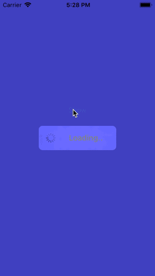

## Overlay indicator



A simple blurry progress indicator with two methods: show and remove.

The simple design is to hardcode the dimensions. You could change the style as you wish.

```swift
let width = superview.frame.size.width / 2 > 200 ? 200 : superview.frame.size.width / 2
let height: CGFloat = 50.0
let activityIndicatorSize: CGFloat = 40
```

### Add to top of all views

```swift
// show
self.showSpinner(onWindow: UIApplication.shared.keyWindow!, text: "Loading..")
// remove
self.removeSpinner()
```

### Add to current view

```swift
// show
self.showSpinner(onView: self.view, text: "Loading..")
// remove
self.removeSpinner()
```
