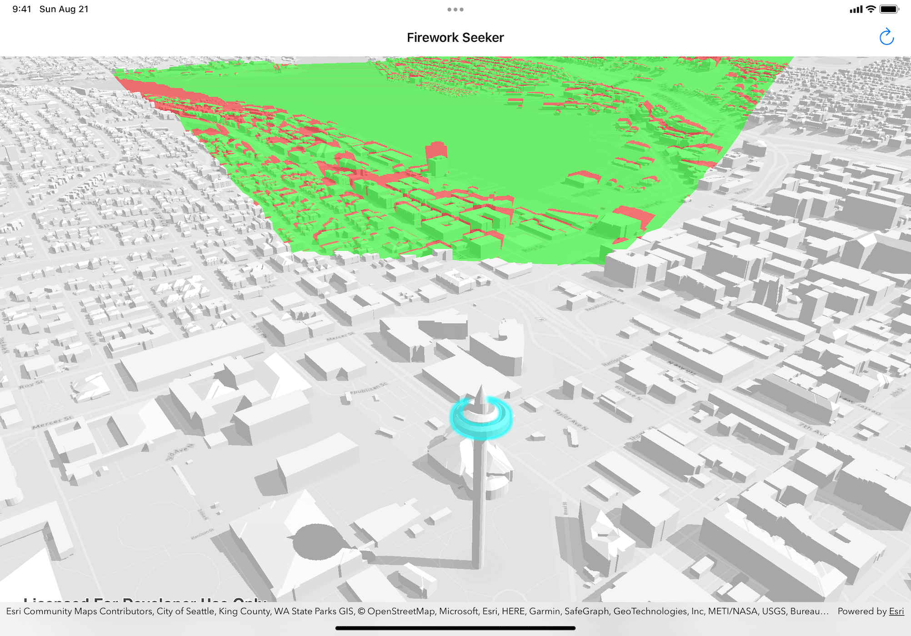
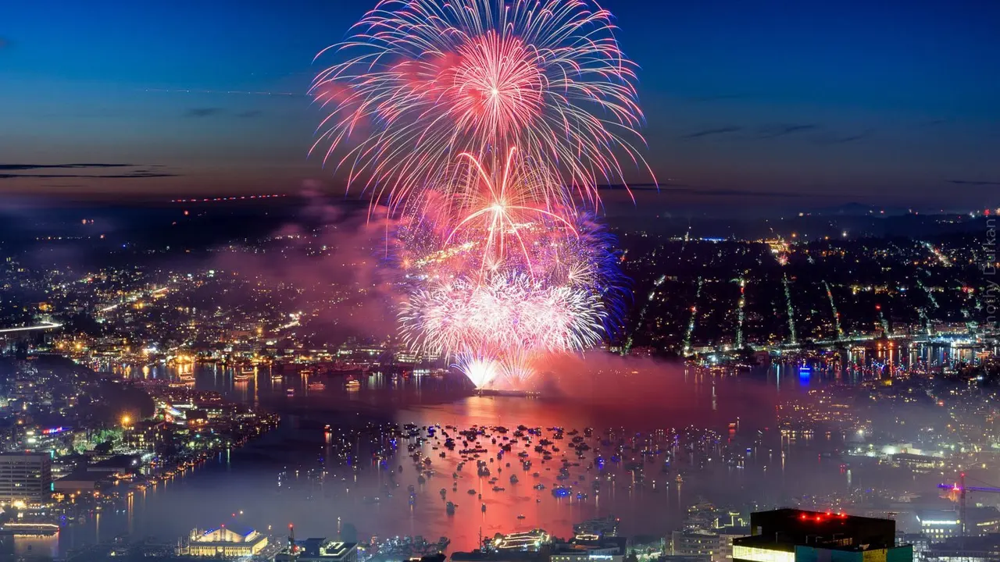
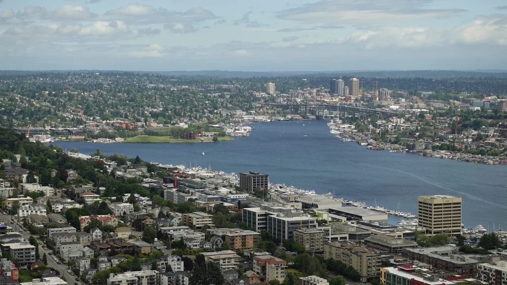

# Seattle Fireworks Seeker



This is the 2nd demo I showed in 2022 Esri Summer Intern Program - Tech Tuesday event on 20220802, *ArcGIS Runtime Developer Technology Made Easy*.

This app demonstrates how easy it is to write a native and performant 3D analysis app on iOS using ArcGIS Runtime.

## Background

|Fireworks|Lake Union|
|-|-|
|||

I went to Seattle for the first time during the July 4th weekend. My friends and I wanted to find the best spot to observe the fireworks 🎆 in Seattle, which is set off in the middle of Lake Union this year. Initially we planned to go to one of the taller Amazon buildings, but that is such a hassle; we then explored options such as Space Needle, top floor of his apartment building, SLU waterfront.

Eventually I decided to write an app to scientifically settle the discussion by using a 3D viewshed that shows the view obstruction situation near downtown Seattle. Thanks to City of Seattle's GIS data, I manage to show the result with 3D building models.

## Keywords

ArcGIS Runtime SDK, ArcGIS Runtime, iOS, Swift, Viewshed, 3D, Geoprocessing, Analysis, 

---

```txt
Last revision: 220821
```
