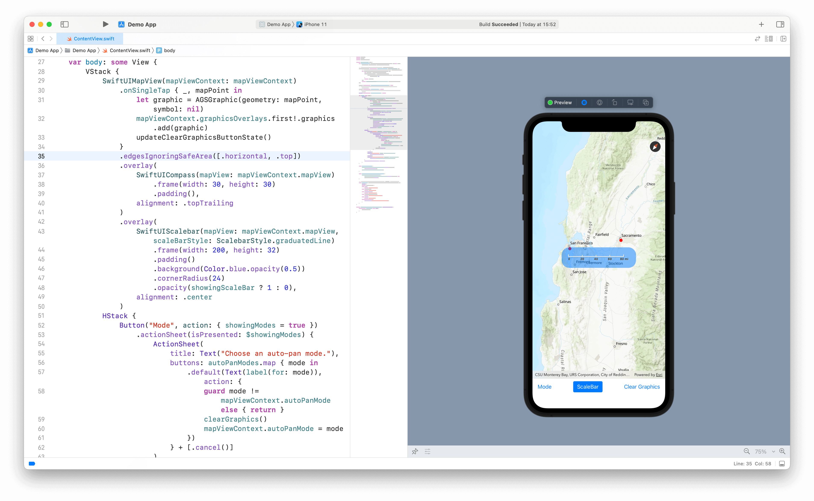

# SwiftUI and ArcGIS iOS SDK Interoperability

This app demos how to use [ArcGIS Runtime SDK for iOS](https://developers.arcgis.com/ios/) (Cocoa/ObjC/UIKit) and [ArcGIS Runtime Toolkit for iOS](https://github.com/Esri/arcgis-runtime-toolkit-ios) (Swift/UIKit) in SwiftUI.

## Features

- [`UIHostingController`](https://developer.apple.com/documentation/swiftui/uihostingcontroller)
- [`UIViewRepresentable`](https://developer.apple.com/documentation/swiftui/uiviewrepresentable)
- [`Coordinator`](https://developer.apple.com/documentation/swiftui/uiviewrepresentable/coordinator) and delegate methods porting
- Add graphics upon tap
- Show toolkit views: [`Compass`](https://github.com/Esri/arcgis-runtime-toolkit-ios/tree/master/Documentation/Compass) and [`Scalebar`](https://github.com/Esri/arcgis-runtime-toolkit-ios/tree/master/Documentation/Scalebar)
- Show location display

## References

- SwiftUI sample: https://github.com/Esri/arcgis-runtime-samples-ios/tree/main/arcgis-ios-sdk-samples/Maps/Display%20a%20map%20SwiftUI
- Apple tutorials: https://developer.apple.com/tutorials/swiftui/interfacing-with-uikit
